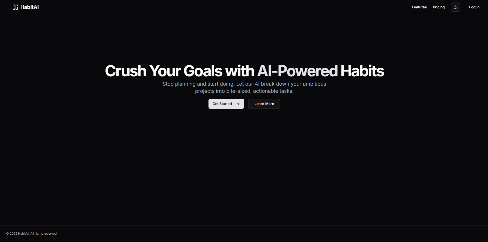
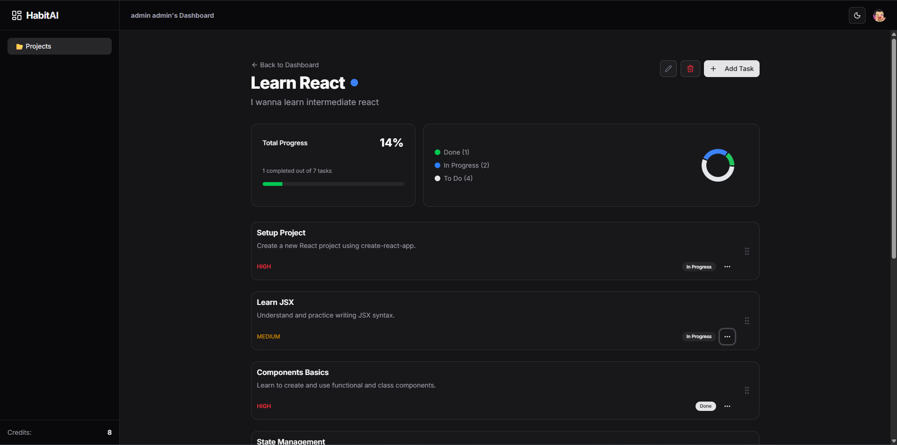

# 🚀 HabitAI

**A Full-Stack, AI-Powered Habit & Project Manager.**
Stop planning and start doing. HabitAI uses **Llama 3.3** to break down your ambitious goals into actionable, bite-sized tasks automatically.

### [🔴 Live Demo](https://habit-tracker-rabbitboii-42.vercel.app/)




## ✨ Key Features

- **🧠 AI Project Breakdown:** Enter a goal (e.g., "Learn React"), and Llama 3.3 generates a structured plan with descriptions and priorities.
- **⚡ Full-Stack Type Safety:** Built with **tRPC** for end-to-end type safety from database to UI.
- **🖱️ Drag & Drop Kanban:** Organize tasks visually with optimistic UI updates (powered by `@dnd-kit`).
- **📊 Visual Analytics:** Track progress with dynamic charts and statistics.
- **🔐 Secure Authentication:** User management via **Clerk**.
- **🎨 Modern UI:** Clean, responsive interface using **Shadcn/UI** and **Tailwind CSS** (with Dark Mode).

## 🛠️ Tech Stack

- **Framework:** Next.js 14 (App Router)
- **Language:** TypeScript
- **Database:** PostgreSQL (Neon.tech)
- **ORM:** Drizzle ORM
- **API:** tRPC (Serverless Functions)
- **AI Model:** Llama 3.3 70B (via Groq)
- **Auth:** Clerk
- **Styling:** Tailwind CSS + Shadcn/UI

## 🚀 Getting Started Locally

1. **Clone the repository**
   ```bash
   git clone https://github.com/RabbitBoii/habit-tracker.git
   cd habit-tracker
   ```

2. **Install dependencies**
    ```bash
    npm install
    ```

3. **Set up Environment Variables Create a `.env.local` file in the root and add your keys:**
    ```bash
    DATABASE_URL="postgres://..."
    NEXT_PUBLIC_CLERK_PUBLISHABLE_KEY="pk_test_..."
    CLERK_SECRET_KEY="sk_test_..."
    GROQ_API_KEY="gsk_..."
    ```

4. **Push Database Schema**
    ```bash
    npx drizzle-kit push
    ```

5. **Run the development server**
    ```bash
    npm run dev
    ```

